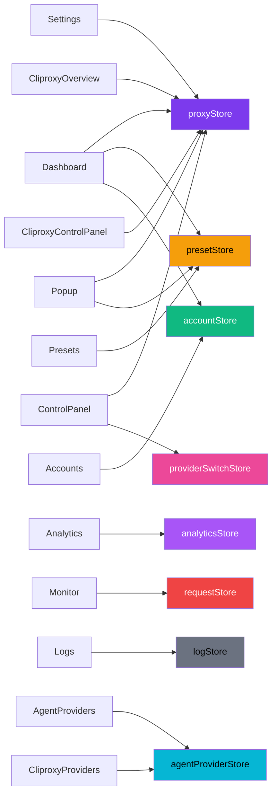
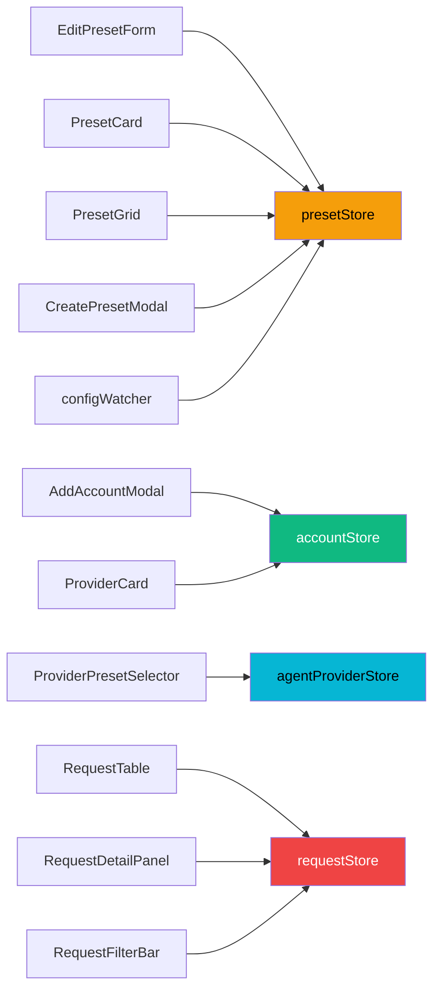
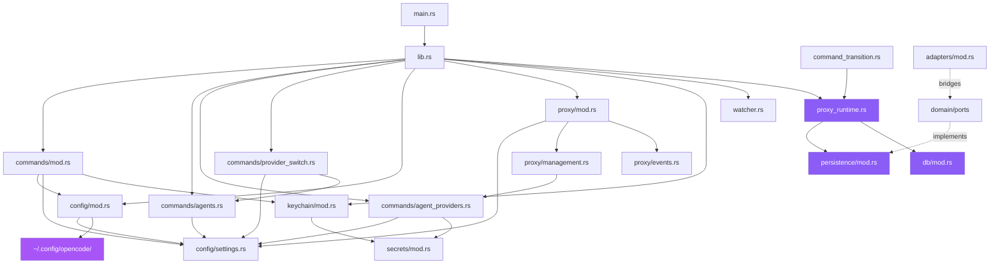

# Aether — Architecture Documentation

> macOS desktop app (Tauri v2 + SolidJS) managing a bundled Go sidecar (`CLIProxyAPI`) as an AI proxy manager. The app provides a GUI for configuring AI agent presets, provider accounts, proxy routing, CLI agent auto-configuration, provider switching, and real-time request monitoring.
>
> *Generated from the GitNexus knowledge graph — 2351 symbols, 4623 relationships, 204 execution flows, 77 functional clusters.*

## System Overview

Aether is a **three-layer** desktop application with a Clean Architecture backend:

```
┌──────────────────────────────────────────────────────────────┐
│                       macOS Desktop                           │
│  ┌────────────────────────────────────────────────────────┐  │   SolidJS Frontend
│  │                 SolidJS (Vite)                         │  │
│  │  14 Pages · 21 Components · 11 Stores                  │  │
│  └──────────────────────────┬─────────────────────────────┘  │
│                             │ Tauri IPC (invoke / emit)       │
│  ┌──────────────────────────▼─────────────────────────────┐  │   Rust Backend
│  │               Tauri v2 (Rust)                          │  │
│  │  ┌───────────────────────────────────────────────────┐ │  │
│  │  │  Commands Layer (Tauri commands)                  │ │  │
│  │  │  commands/mod.rs, agents.rs, agent_providers.rs,  │ │  │
│  │  │  provider_switch.rs                               │ │  │
│  │  └──────────────────────┬────────────────────────────┘ │  │
│  │  ┌──────────────────────▼────────────────────────────┐ │  │   Clean Architecture Core
│  │  │  core/ (Domain → Application → Infrastructure)    │ │  │
│  │  │  domain/ports → application/services → infra/     │ │  │
│  │  └──────────────────────┬────────────────────────────┘ │  │
│  │  ┌──────────────────────▼────────────────────────────┐ │  │
│  │  │  Support Modules                                  │ │  │
│  │  │  config/, proxy/, secrets/, keychain/, watcher.rs │ │  │
│  │  └───────────────────────────────────────────────────┘ │  │
│  └──────────────────────────┬─────────────────────────────┘  │
│                             │ Shell plugin (spawn/kill)       │
│  ┌──────────────────────────▼─────────────────────────────┐  │   Go Sidecar
│  │           CLIProxyAPI (Go)                             │  │
│  │  AI proxy server on localhost:8317                     │  │
│  └────────────────────────────────────────────────────────┘  │
└──────────────────────────────────────────────────────────────┘
```

### Windows
- **Main window** (1200×800) — Full management UI with sidebar navigation. Close → hides to tray.
- **Popup window** (320×400, transparent) — Tray popup. Auto-hides when focus lost.

### Tray Integration
- System tray icon with left-click handler to toggle popup visibility.
- Main window close is intercepted → hidden rather than quit (stays in tray).

## Architecture Diagram

```mermaid
graph TB
    subgraph Frontend["Frontend (SolidJS)"]
        direction TB

        subgraph Pages
            App[App.tsx Router]
            Dashboard[Dashboard]
            Analytics[Analytics]
            Presets[Presets]
            Monitor[Monitor]
            Logs[Logs]
            Agents[Agents]
            AgentProviders[AgentProviders]
            Accounts[Accounts]
            Settings[Settings]
            ControlPanel[ControlPanel]
            CliproxyOV[CliproxyOverview]
            CliproxyProv[CliproxyProviders]
            CliproxyCP[CliproxyControlPanel]
            Popup[Popup]
        end

        subgraph Components
            EditPreset[EditPresetForm]
            PresetCard[PresetCard]
            PresetGrid[PresetGrid]
            CreatePreset[CreatePresetModal]
            AddAccount[AddAccountModal]
            ProviderCard[ProviderCard]
            ProviderPresetSel[ProviderPresetSelector]
            ReqTable[RequestTable]
            ReqDetail[RequestDetailPanel]
            ReqFilter[RequestFilterBar]
        end

        subgraph Stores
            proxyStore[proxyStore]
            presetStore[presetStore]
            accountStore[accountStore]
            requestStore[requestStore]
            agentProvStore[agentProviderStore]
            analyticsStore[analyticsStore]
            logStore[logStore]
            configWatcher[configWatcher]
            providerSwitchStore[providerSwitchStore]
            commandClient[commandClient]
            themeStore[themeStore]
        end
    end

    subgraph Backend["Backend (Tauri / Rust)"]
        direction TB

        MainRs[main.rs]
        LibRs[lib.rs run]

        subgraph Commands
            CmdMod[commands/mod.rs]
            CmdAgents[commands/agents.rs]
            CmdAgentProv[commands/agent_providers.rs]
            CmdProvSwitch[commands/provider_switch.rs]
        end

        subgraph Core["core/ Clean Architecture"]
            direction TB
            DomainPorts[domain/ports]
            ProxyRuntime[application/services/proxy_runtime]
            CmdTransition[application/services/command_transition]
            Persistence[infrastructure/persistence]
            Db[infrastructure/db]
            Adapters[infrastructure/adapters]
        end

        subgraph Config
            ConfigMod[config/mod.rs]
            ConfigSettings[config/settings.rs]
        end

        subgraph ProxySub
            ProxyMod[proxy/mod.rs]
            ProxyManagement[proxy/management.rs]
            ProxyEvents[proxy/events.rs]
        end

        Secrets[secrets/mod.rs]
        Keychain[keychain/mod.rs]
        Watcher[watcher.rs]
    end

    subgraph Sidecar["Sidecar (Go)"]
        CLIProxy[CLIProxyAPI port 8317]
        MgmtAPI[REST Management API]
        WSEvents[WebSocket Events]
    end

    subgraph Externals["External Services"]
        Anthropic[Anthropic API]
        OpenAI[OpenAI API]
        Google[Google API]
    end

    %% Frontend to Stores
    Dashboard --> proxyStore
    Dashboard --> accountStore
    Dashboard --> presetStore
    Analytics --> analyticsStore
    Presets --> presetStore
    Monitor --> requestStore
    Logs --> logStore
    Agents --> agentProvStore
    AgentProviders --> agentProvStore
    Accounts --> accountStore
    Settings --> proxyStore
    ControlPanel --> proxyStore
    CliproxyOV --> proxyStore
    CliproxyProv --> agentProvStore
    CliproxyCP --> proxyStore
    Popup --> proxyStore
    Popup --> presetStore

    EditPreset --> presetStore
    PresetCard --> presetStore
    PresetGrid --> presetStore
    CreatePreset --> presetStore
    AddAccount --> accountStore
    ProviderCard --> accountStore
    ProviderPresetSel --> agentProvStore
    ReqTable --> requestStore
    ReqDetail --> requestStore
    ReqFilter --> requestStore
    configWatcher --> presetStore

    %% Backend internal
    MainRs --> LibRs
    LibRs --> CmdMod
    LibRs --> CmdAgents
    LibRs --> CmdAgentProv
    LibRs --> CmdProvSwitch
    LibRs --> ConfigMod
    LibRs --> ProxyMod
    LibRs --> Keychain
    LibRs --> Watcher
    LibRs --> ProxyRuntime

    CmdMod --> ConfigMod
    CmdMod --> ConfigSettings
    CmdMod --> Keychain
    CmdAgents --> ConfigSettings
    CmdAgentProv --> ConfigSettings
    CmdAgentProv --> Secrets
    CmdProvSwitch --> ConfigSettings
    CmdProvSwitch --> CmdAgents

    ProxyMod --> ConfigSettings
    ProxyMod --> ProxyEvents
    ProxyMod --> ProxyManagement
    ProxyManagement --> CmdAgentProv

    ConfigMod --> ConfigSettings

    Keychain --> Secrets

    %% Core layers
    ProxyRuntime --> Persistence
    ProxyRuntime --> Db
    CmdTransition --> ProxyRuntime
    DomainPorts -.->|implements| Persistence
    Adapters -.->|bridges| DomainPorts

    %% Frontend to Backend IPC
    Stores -.->|Tauri invoke| CmdMod
    Stores -.->|Tauri invoke| CmdAgents
    Stores -.->|Tauri invoke| CmdAgentProv
    Stores -.->|Tauri invoke| CmdProvSwitch
    Stores -.->|Tauri invoke| ProxyMod
    Stores -.->|Tauri invoke| ConfigMod
    Stores -.->|Tauri invoke| ConfigSettings
    Stores -.->|Tauri invoke| Keychain

    %% Backend to Sidecar
    ProxyMod --> CLIProxy
    ProxyManagement --> CLIProxy
    ProxyEvents --> WSEvents
    CLIProxy --> MgmtAPI

    %% External API calls
    CmdMod -.->|validate_api_key| Anthropic
    CmdMod -.->|validate_api_key| OpenAI
    CmdMod -.->|validate_api_key| Google

    style Frontend fill:#1a1a2e,color:#e5e7eb,stroke:#6366f1
    style Backend fill:#1a1a2e,color:#e5e7eb,stroke:#f59e0b
    style Sidecar fill:#1a1a2e,color:#e5e7eb,stroke:#10b981
    style Externals fill:#1a1a2e,color:#e5e7eb,stroke:#ef4444
```



## Layer Breakdown

### Frontend (SolidJS)

| Area | Files | Responsibility |
|------|-------|---------------|
| **Entry** | `index.tsx`, `App.tsx` | Vite mount, router (14 routes), layout, store initialization, keyboard shortcuts (Cmd+, → Settings, Cmd+N → New preset) |
| **Pages** | `Dashboard`, `Analytics`, `Presets`, `Monitor`, `Logs`, `Agents`, `AgentProviders`, `Accounts`, `Settings`, `ControlPanel`, `CliproxyOverview`, `CliproxyProviders`, `CliproxyControlPanel`, `Popup` | Top-level views, each consuming 1-3 stores |
| **Components** | `AppShell`, `Sidebar`, `EditPresetForm`, `CreatePresetModal`, `PresetCard`, `PresetGrid`, `PresetEmptyState`, `AddAccountModal`, `ProviderCard`, `ProviderPresetSelector`, `RequestTable`, `RequestDetailPanel`, `RequestFilterBar`, `GlassCard`, `Toast`, `Modal`, `Badge`, `Button`, `Input`, `NavGroup`, `NavItem` | Reusable UI building blocks |
| **Stores** | `proxyStore`, `presetStore`, `accountStore`, `requestStore`, `agentProviderStore`, `analyticsStore`, `logStore`, `configWatcher`, `providerSwitchStore`, `commandClient`, `themeStore` | Reactive state + Tauri command wrappers |
| **Config** | `providerPresets.ts` | Provider preset definitions |
| **Styles** | `app.css`, `tokens.css`, `popup.css` | Tailwind v4 with custom glassmorphism tokens |

**Store ownership:**

| Store | Domain | Key consumers |
|-------|--------|---------------|
| `proxyStore` | Proxy lifecycle, status polling (5s), event streaming, port | Dashboard, Settings, Popup, Cliproxy*, ControlPanel |
| `presetStore` | Preset CRUD, model/provider parsing, refresh from watcher | Dashboard, Presets, Popup, EditPresetForm, PresetCard, configWatcher |
| `accountStore` | Provider accounts (Anthropic, OpenAI, Google), keys, validation | Dashboard, Accounts, AddAccountModal, ProviderCard |
| `requestStore` | Live request monitoring from WebSocket event stream | Monitor, RequestTable, RequestDetailPanel, RequestFilterBar |
| `agentProviderStore` | Agent providers (Groq, Together, OpenRouter...), well-known presets, model fetch | Agents, AgentProviders, CliproxyProviders, ProviderPresetSelector |
| `analyticsStore` | Usage stats (by hour, day, provider), caching | Analytics |
| `logStore` | Proxy logs (file-based) | Logs |
| `configWatcher` | External config hot-reload polling | App.tsx → triggers presetStore.refresh |
| `providerSwitchStore` | Provider switching state and operations | ControlPanel, Settings |
| `commandClient` | Tauri command invocation helpers | All stores |
| `themeStore` | UI theme state | AppShell, global UI |

### Backend (Tauri / Rust)

#### App Entry

| Module | File(s) | Responsibility |
|--------|---------|---------------|
| **App Entry** | `main.rs` | Single entry point → `lib.rs::run()` |
| **App Init** | `lib.rs` | Tauri Builder: 56 commands, tray icon, popup toggle, window lifecycle, plugins (shell, dialog, process, updater, log), auto-start proxy via ProxyRuntimeService, config watcher |

#### Commands Layer (Tauri Commands)

| Module | File(s) | Responsibility |
|--------|---------|---------------|
| **Commands** | `commands/mod.rs` | Tauri commands: preset CRUD, proxy lifecycle, provider accounts, file I/O, version, settings, analytics |
| **Agent Commands** | `commands/agents.rs` | CLI agent detection & configuration (Claude Code, Cursor, Windsurf, etc.), OpenCode config management |
| **Agent Providers** | `commands/agent_providers.rs` | Custom provider management (Groq, Together, OpenRouter...), well-known presets, model catalog, key storage, validation |
| **Provider Switch** | `commands/provider_switch.rs` | Exclusive/additive provider switching, post-switch sync, OpenCode model refresh, config warnings |

#### Clean Architecture Core (`core/`)

| Layer | Module | Responsibility |
|-------|--------|---------------|
| **Domain** | `core/domain/ports` | Interface definitions (ports) for infrastructure adapters |
| **Application** | `core/application/services/proxy_runtime` | Proxy runtime service — start/stop lifecycle management |
| **Application** | `core/application/services/command_transition` | Command transition service for state machine transitions |
| **Application** | `core/application/services/mod.rs` | Service module aggregation |
| **Infrastructure** | `core/infrastructure/persistence` | SQLite persistence adapter, database operations |
| **Infrastructure** | `core/infrastructure/db` | SQLite database initialization, migrations, schema versioning |
| **Infrastructure** | `core/infrastructure/adapters` | Adapter implementations bridging ports to concrete infrastructure |

#### Support Modules

| Module | File(s) | Responsibility |
|--------|---------|---------------|
| **Config** | `config/mod.rs` | Read/write OpenCode config, preset operations, model variant parsing |
| **Settings** | `config/settings.rs` | App settings persistence (auto-start, proxy port, etc.) via `~/.config/aether/settings.json` |
| **Proxy** | `proxy/mod.rs` | Sidecar lifecycle — spawn, health-check loop, crash detection, stop, restart, status events |
| **Proxy Mgmt** | `proxy/management.rs` | CLIProxy Management API client — syncs agent providers into CLIProxy after health check |
| **Proxy Events** | `proxy/events.rs` | WebSocket event subscription, request event parsing, Tauri event forwarding |
| **Secrets** | `secrets/mod.rs` | AES-256-GCM encrypted file store (`secrets.enc`), machine-uuid derived key |
| **Keychain** | `keychain/mod.rs` | Thin wrapper over `secrets` — store/get/delete/mask API keys |
| **Watcher** | `watcher.rs` | File system watcher for config hot-reload — monitors mtime of both config files every 2s, emits `config-changed` events |

**Tauri commands (56) organized by domain:**

| Domain | Commands |
|--------|----------|
| **Preset CRUD** | `get_presets`, `set_active_preset`, `create_preset`, `update_preset`, `delete_preset`, `duplicate_preset`, `get_available_models`, `get_model_variants`, `backup_slim_config` |
| **Proxy** | `start_proxy`, `stop_proxy`, `restart_proxy`, `get_proxy_status`, `start_event_stream` |
| **Accounts** | `get_provider_accounts`, `add_provider_account`, `update_api_key`, `delete_provider_account`, `validate_api_key` |
| **Agent Providers** | `get_agent_providers`, `get_provider_mode_matrix`, `get_well_known_providers`, `add_agent_provider`, `update_agent_provider`, `delete_agent_provider`, `fetch_provider_models`, `validate_agent_provider_key`, `get_agent_provider_key` |
| **Provider Switch** | `get_providers`, `get_current_provider`, `add_provider`, `update_provider`, `delete_provider`, `switch_provider`, `remove_provider_from_live_config`, `import_default_config`, `import_providers_from_live`, `update_providers_sort_order`, `update_tray_menu`, `tray_select_provider` |
| **Agent Config** | `detect_cli_agents`, `configure_cli_agent`, `deconfigure_opencode`, `refresh_opencode_models`, `preview_opencode_config`, `preview_claude_code_config` |
| **File I/O** | `write_file`, `read_file` |
| **Analytics** | `fetch_usage_stats`, `read_usage_cache`, `write_usage_cache` |
| **Settings** | `get_settings`, `update_settings` |
| **Misc** | `get_version_info`, `show_main_window`, `run_migration_validation_gates` |

### Sidecar (Go)

The `CLIProxyAPI` binary from `router-for-me/CLIProxyAPI`:
- Runs as an **AI proxy server** on port **8317**
- Managed via Tauri shell plugin (spawn → stdin commands → kill)
- Version pinned in `.cliproxyapi-version`, binary at `src-tauri/binaries/cliproxyapi-{target-triple}`
- Config generated at `~/.config/aether/proxy-config.yaml`
- **Management API**: REST endpoint for fetching usage stats, syncing agent providers
- **WebSocket**: Pushes real-time request events for live monitoring

---

## Functional Areas

The knowledge graph identified **77 clusters** grouped into these functional domains:

### 1. Preset Management
> CRUD operations for AI agent presets (model/provider/skills). Each preset configures agents (orchestrator, oracle, librarian, etc.) with specific models and routing rules.

**Key flows:**
- `CreatePresetModal` → `handleCreate` → `presetStore.createPreset` → `create_preset` command → `config/mod.rs` → `write_slim_config` (atomic write)
- `EditPresetForm` → `handleSave` → `update_preset` → atomic write + refresh
- `PresetCard` → `splitModelId` → resolves provider + model from compound ID
- `duplicate_preset` → auto-names with `-copy`, `-copy-2` etc.
- `delete_preset` → if active, auto-switches to first remaining preset

**Files:** `Presets.tsx`, `PresetCard.tsx`, `PresetGrid.tsx`, `EditPresetForm.tsx`, `CreatePresetModal.tsx`, `PresetEmptyState.tsx`, `presetStore.ts`, `config/mod.rs`

### 2. Provider Account Management
> Manage API keys for AI providers (OpenAI, Anthropic, Google). Keys stored in AES-256-GCM encrypted file (replaced macOS Keychain to eliminate password prompts). Includes validation via lightweight `/v1/models` calls.

**Key flows:**
- `get_provider_accounts` → iterates supported providers (anthropic, openai, google) → reads from secrets → masks keys → returns status
- `add_provider_account` → `validate_api_key` first (HTTP GET to provider) → if valid → `store_api_key` via secrets
- `update_api_key` → same flow, overwrites existing
- `delete_provider_account` → removes from secrets store

**Files:** `Accounts.tsx`, `AddAccountModal.tsx`, `ProviderCard.tsx`, `accountStore.ts`, `commands/mod.rs`, `keychain/mod.rs`, `secrets/mod.rs`

### 3. Proxy Lifecycle Management
> Start, stop, restart, and monitor the Go sidecar. Health-check loop polls sidecar status every 10s. Crash detection via child process watcher.

**Key flows:**
- `start_proxy` → generate config → spawn sidecar → store `CommandChild` → spawn health-check loop
  - Health check: GET `http://localhost:{port}/v0/health` → if success, emit `Running`
  - If crash detected (health fails after running), emit `Crashed` with error message
- `stop_proxy` → kill child process → emit `Stopped`
- `restart_proxy` → stop → 500ms delay → start
- Background `CommandChild` watcher detects process termination → emits `Crashed` if not intentional stop
- Status events: `proxy-status-changed` emitted to frontend via Tauri

**Files:** `proxy/mod.rs`, `proxy/events.rs`, `proxy/management.rs`, `proxyStore.ts`, `config/settings.rs`, `core/application/services/proxy_runtime.rs`

### 4. Provider Switching
> Switch between exclusive and additive provider modes, syncing models and updating OpenCode configuration with warnings.

**Key flows (from knowledge graph traces):**

**Exclusive Switch** (7 steps):
```
provider_switch.rs          agents.rs
─────────────────           ─────────
exclusive_switch()
    │
    ├─► switch_normal()
    │       │
    │       └─► run_post_switch_sync()
    │               │
    │               ├─► refresh_opencode_models()
    │               ├─► configure_opencode()
    │               ├─► read_opencode_json_for_merge()
    │               └─► emit_opencode_warning()
    └─► (or) read_settings() → settings_path()
```

**Additive Switch** (7 steps):
```
provider_switch.rs          agents.rs
─────────────────           ─────────
additive_switch()
    │
    ├─► switch_normal()
    │       │
    │       └─► run_post_switch_sync()
    │               │
    │               ├─► refresh_opencode_models()
    │               ├─► configure_opencode()
    │               ├─► read_opencode_json_for_merge()
    │               └─► emit_opencode_warning()
    └─► (or) read_settings() → settings_path()
```

**Files:** `commands/provider_switch.rs`, `commands/agents.rs`, `config/settings.rs`, `stores/providerSwitchStore.ts`

### 5. Request Monitoring
> Real-time display of proxied API requests via WebSocket event stream from CLIProxy.

**Key flows:**
- `start_event_stream` (on Monitor mount) → subscribes to WebSocket → Tauri event forwarding
- Each request event contains: id, timestamp, method, endpoint, provider, status code, latency, tokens
- Events flow through `requestStore` → UI updates
- `RequestFilterBar` provides filtering capabilities

**Files:** `Monitor.tsx`, `RequestTable.tsx`, `RequestDetailPanel.tsx`, `RequestFilterBar.tsx`, `requestStore.ts`, `proxy/events.rs`

### 6. Agent Detection & Configuration
> Detect installed CLI agent tools (Claude Code, Cursor, Windsurf, etc.) and auto-configure them to use the Aether proxy.

**Key flows:**
- `detect_cli_agents` → checks `which_exists()` for known binaries → returns status per agent
- `configure_cli_agent` → writes proxy config to appropriate dotfiles per agent
  - Claude Code → `~/.claude/settings.json`
  - Codex CLI → `~/.codex/config.toml` + `auth.json`
  - Gemini CLI → env var `CODE_ASSIST_ENDPOINT`
  - Amp CLI → `~/.config/amp/settings.json`
  - OpenCode → `~/.config/opencode/opencode.json`
  - Kiro → env var `KIRO_ENDPOINT`

**Files:** `commands/agents.rs`, `config/settings.rs`, `Agents.tsx`

### 7. Secrets & Encryption
> AES-256-GCM encrypted file store for API keys, using machine UUID for key derivation.

**Key flows (from knowledge graph traces):**

**Fetch Provider Models** (6 steps):
```
agent_providers.rs          secrets/mod.rs
─────────────────           ──────────────
fetch_provider_models()
    │
    ├─► keychain_get_raw()
    │       │
    │       ├─► get()
    │       │       │
    │       │       ├─► make_cipher()
    │       │       │       │
    │       │       │       └─► derive_key()
    │       │       │               │
    │       │       │               └─► get_machine_uuid()
    │       │       └─► AES-256-GCM decrypt
    └─► use key to fetch models
```

**Files:** `secrets/mod.rs`, `keychain/mod.rs`, `commands/agent_providers.rs`

### 8. App Bootstrap & Config Watching
> Initialize the Tauri app, register commands, setup tray/icon, start proxy auto-start, and config watcher.

**Key flows (from knowledge graph traces):**

**App Bootstrap** (3-step core flows):
```
main.rs ──► lib.rs::run() ──► [branch]
                                    │
                                    ├─► check_auto_start_setting()
                                    ├─► initialize() → persistence adapter
                                    └─► start() → proxy_runtime
```

- Tray click → toggle popup window (show/hide)
- Main window close → intercept → hide instead of quit (stays in tray)
- Auto-start proxy if `settings.json` has `auto_start_proxy` flag
- Config watcher: polls `~/.config/opencode/opencode.json` + `oh-my-opencode-slim.json` every 2s
- On mtime change → emit `config-changed` event → frontend refreshes preset store

**Files:** `main.rs`, `lib.rs`, `watcher.rs`, `config/settings.rs`, `core/application/services/proxy_runtime.rs`

### 9. Clean Architecture Core
> Domain-driven design with ports, application services, and infrastructure adapters.

**Layers:**
- **Domain Ports** (`core/domain/ports`): Interface definitions that infrastructure adapters implement
- **Application Services** (`core/application/services`):
  - `proxy_runtime`: Proxy lifecycle management (start/stop)
  - `command_transition`: State machine command transitions
- **Infrastructure** (`core/infrastructure`):
  - `persistence`: SQLite persistence adapter
  - `db`: Database initialization, migrations, schema versioning
  - `adapters`: Concrete implementations bridging domain ports to infrastructure

**Files:** `core/domain/mod.rs`, `core/domain/ports/mod.rs`, `core/application/mod.rs`, `core/application/services/mod.rs`, `core/application/services/proxy_runtime.rs`, `core/application/services/command_transition.rs`, `core/infrastructure/mod.rs`, `core/infrastructure/persistence/mod.rs`, `core/infrastructure/db/mod.rs`, `core/infrastructure/adapters/mod.rs`

---

## Key Execution Flows

### Flow 1: Exclusive Provider Switch (7 steps)
The longest cross-community flow, switching providers and syncing OpenCode config:

```
provider_switch.rs          agents.rs              settings.rs
─────────────────           ─────────              ───────────
exclusive_switch()
    │
    ├─► switch_normal()
    │       │
    │       └─► run_post_switch_sync()
    │               │
    │               ├─► refresh_opencode_models()
    │               ├─► configure_opencode()
    │               ├─► read_opencode_json_for_merge()
    │               └─► emit_opencode_warning()
    │
    └─► (alt path) read_settings() → settings_path()
```

### Flow 2: Fetch Provider Models — Key Decryption (6 steps)
Cross-community flow from agent providers through secrets to machine UUID:

```
agent_providers.rs          secrets/mod.rs
─────────────────           ──────────────
fetch_provider_models()
    │
    ├─► keychain_get_raw()
    │       │
    │       ├─► get()
    │       │       │
    │       │       ├─► make_cipher()
    │       │       │       │
    │       │       │       └─► derive_key()
    │       │       │               │
    │       │       │               └─► get_machine_uuid()
    │       │       └─► AES-256-GCM decrypt
    └─► use decrypted key for API call
```

### Flow 3: Get Agent Providers — Key Decryption (6 steps)
Same decryption chain as Flow 2, different entry point:

```
agent_providers.rs          secrets/mod.rs
─────────────────           ──────────────
get_agent_providers()
    │
    ├─► keychain_get_raw()
    │       │
    │       └─► get() → make_cipher() → derive_key() → get_machine_uuid()
    └─► return decrypted provider list
```

### Flow 4: Sync Providers — Proxy Management (6 steps)
Proxy management layer syncing providers through secrets:

```
proxy/management.rs         secrets/mod.rs
─────────────────           ──────────────
try_sync_providers()
    │
    ├─► get_api_key()
    │       │
    │       └─► get() → make_cipher() → derive_key() → get_machine_uuid()
    └─► sync providers to CLIProxy
```

### Flow 5: App Bootstrap — Auto-Start (3 steps)
```
main.rs ──► lib.rs::run() ──► check_auto_start_setting()
```

### Flow 6: App Bootstrap — Persistence Init (3 steps)
```
main.rs ──► lib.rs::run() ──► initialize() → SqlitePersistenceAdapter
```

### Flow 7: App Bootstrap — Proxy Start (3 steps)
```
main.rs ──► lib.rs::run() ──► start() → proxy_runtime
```

### Flow 8: Additive Provider Switch (7 steps)
Same structure as exclusive switch but marks live config as managed:

```
provider_switch.rs          agents.rs
─────────────────           ─────────
additive_switch()
    │
    ├─► switch_normal()
    │       │
    │       └─► run_post_switch_sync()
    │               │
    │               ├─► refresh_opencode_models()
    │               ├─► configure_opencode()
    │               ├─► read_opencode_json_for_merge()
    │               └─► emit_opencode_warning()
    └─► (alt path) read_settings() → settings_path()
```

---

## Dependency Graph

### Frontend: Pages → Stores



### Frontend: Components → Stores



### Backend: Module Dependencies



---

## Configuration & File Paths

| File | Location | Purpose |
|------|----------|---------|
| OpenCode config | `~/.config/opencode/opencode.json` | AI models & providers definition |
| Slim preset config | `~/.config/opencode/oh-my-opencode-slim.json` | Preset definitions |
| Proxy config | `~/.config/aether/proxy-config.yaml` | Auto-generated CLIProxyAPI config |
| App settings | `~/.config/aether/settings.json` | App settings (auto-start, proxy port) |
| Secrets store | `~/.config/aether/secrets.enc` | AES-256-GCM encrypted API keys |
| Agent providers | `~/.config/aether/agent-providers.json` | Agent provider definitions |
| Sidecar binary | `src-tauri/binaries/cliproxyapi-{target-triple}` | Bundled Go binary |
| Sidecar version | `.cliproxyapi-version` | Pinned version |

> **Why `~/.config/aether/` not `~/Library/Application Support/`?**
> The Go sidecar's flag parser breaks on spaces in paths.

---

## File Index

### Rust Backend (`src-tauri/src/`)

| Module | Files | Role |
|--------|-------|------|
| **App Entry** | `main.rs` | Entry point |
| **App Init** | `lib.rs` | Tauri setup: commands, tray, popup, plugins, auto-start, watcher |
| **Commands** | `commands/mod.rs` | Tauri commands: presets, proxy, accounts, file I/O, version, settings, analytics |
| **Agent Commands** | `commands/agents.rs` | AI agent detection & configuration, OpenCode config management |
| **Agent Providers** | `commands/agent_providers.rs` | Custom provider CRUD, well-known presets, model catalog |
| **Provider Switch** | `commands/provider_switch.rs` | Exclusive/additive provider switching, post-switch sync |
| **Config** | `config/mod.rs` | Config read/write, path resolution |
| **Settings** | `config/settings.rs` | Settings persistence |
| **Proxy** | `proxy/mod.rs` | Sidecar lifecycle, health check, crash detection |
| **Proxy Management** | `proxy/management.rs` | CLIProxy management API client, provider sync |
| **Proxy Events** | `proxy/events.rs` | WebSocket event subscription, request event forwarding |
| **Secrets** | `secrets/mod.rs` | AES-256-GCM encrypted file store, machine-uuid key derivation |
| **Keychain** | `keychain/mod.rs` | API key wrapper over secrets |
| **Watcher** | `watcher.rs` | Config hot-reload polling |
| **Core: Domain** | `core/domain/mod.rs`, `core/domain/ports/mod.rs` | Domain interfaces (ports) |
| **Core: Application** | `core/application/services/proxy_runtime.rs`, `command_transition.rs` | Proxy runtime, command transition services |
| **Core: Infrastructure** | `core/infrastructure/persistence/mod.rs`, `db/mod.rs`, `adapters/mod.rs` | SQLite persistence, DB migrations, adapters |

### Frontend (`src/`)

| Category | Files | Role |
|----------|-------|------|
| **Entry** | `index.tsx`, `App.tsx` | Router, layout, store initialization |
| **Pages** | `Dashboard`, `Analytics`, `Presets`, `Monitor`, `Logs`, `Agents`, `AgentProviders`, `Accounts`, `Settings`, `ControlPanel`, `CliproxyOverview`, `CliproxyProviders`, `CliproxyControlPanel`, `Popup` | Top-level views consuming 1-3 stores each |
| **Components** | `AppShell`, `Sidebar`, `EditPresetForm`, `CreatePresetModal`, `PresetCard`, `PresetGrid`, `PresetEmptyState`, `AddAccountModal`, `ProviderCard`, `ProviderPresetSelector`, `RequestTable`, `RequestDetailPanel`, `RequestFilterBar`, `GlassCard`, `Toast`, `Modal`, `Badge`, `Button`, `Input`, `NavGroup`, `NavItem` | Reusable UI elements |
| **Stores** | `proxyStore`, `presetStore`, `accountStore`, `requestStore`, `agentProviderStore`, `analyticsStore`, `logStore`, `configWatcher`, `providerSwitchStore`, `commandClient`, `themeStore` | Reactive state + Tauri command wrappers |
| **Config** | `providerPresets.ts` | Provider preset definitions |
| **Styles** | `app.css`, `tokens.css`, `popup.css` | Tailwind v4 with glassmorphism tokens |

---

## Store Ownership Summary

Each store owns a specific domain. Know which store a page/component depends on before editing.

| Store | Domain | Consumed By (Pages) | Consumed By (Components) |
|-------|--------|---------------------|--------------------------|
| `proxyStore` | Proxy lifecycle, status polling, event stream, port | Dashboard, Settings, Popup, CliproxyOverview, CliproxyProviders, CliproxyControlPanel, ControlPanel | AppShell, all pages needing status |
| `presetStore` | Preset CRUD, model/provider parsing, refresh | Dashboard, Presets, Popup | EditPresetForm, PresetCard, PresetGrid, CreatePresetModal, configWatcher |
| `accountStore` | Provider accounts (Anthropic, OpenAI, Google), API key validation | Accounts, Dashboard | AddAccountModal, ProviderCard |
| `requestStore` | Live request monitoring | Monitor | RequestTable, RequestDetailPanel, RequestFilterBar |
| `agentProviderStore` | Agent providers (Groq, Together, OpenRouter...), model sync | Agents, AgentProviders, CliproxyProviders | ProviderPresetSelector |
| `analyticsStore` | Usage stats (hourly, daily, provider breakdown), cache | Analytics | — |
| `logStore` | Proxy log streaming | Logs | — |
| `configWatcher` | External config hot-reload (opencode.json, slim.json) | App.tsx (triggers presetStore.refresh on change) | — |
| `providerSwitchStore` | Provider switching state, exclusive/additive modes | ControlPanel, Settings | — |
| `commandClient` | Tauri command invocation helpers | All stores (internal) | — |
| `themeStore` | UI theme state | AppShell (internal) | — |

---

*Generated from GitNexus knowledge graph analysis. Index: 2351 symbols, 4623 relationships, 77 clusters, 204 execution flows.*
