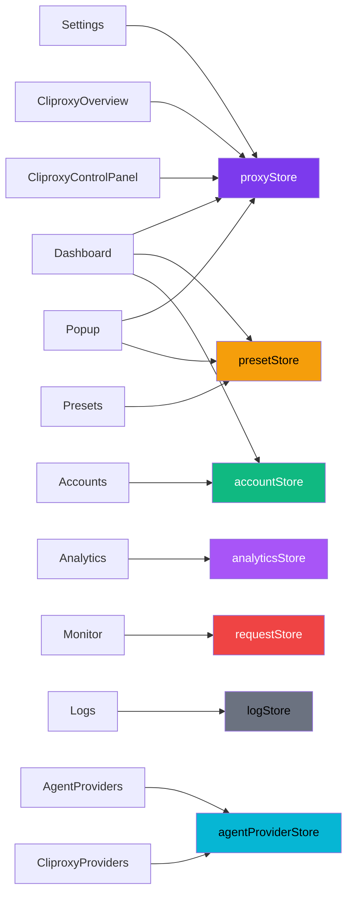
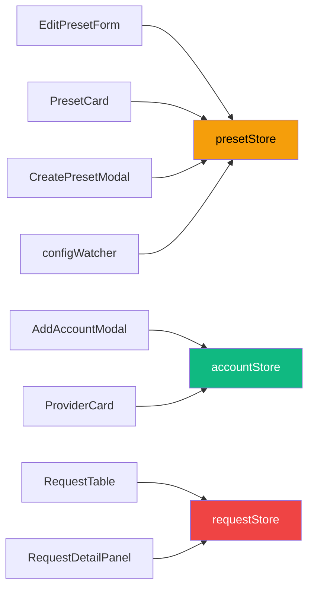
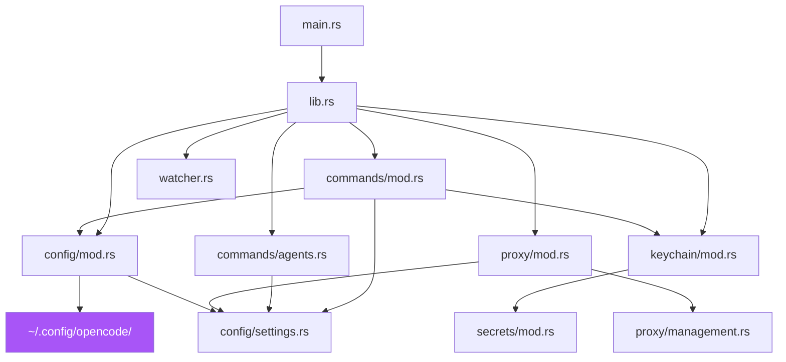

# Aether — Architecture Documentation

> macOS desktop app (Tauri v2 + SolidJS) managing a bundled Go sidecar (`CLIProxyAPI`) as an AI proxy manager. The app provides a GUI for configuring AI agent presets, provider accounts, proxy routing, CLI agent auto-configuration, and real-time request monitoring.
>
> *Generated from the GitNexus knowledge graph — 859 symbols, 1,645 relationships, 71 execution flows.*

## System Overview

Aether is a **three-layer** desktop architecture:

```
┌──────────────────────────────────────────────────────┐
│                     macOS Desktop                     │
│  ┌────────────────────────────────────────────────┐  │   SolidJS Frontend
│  │                 SolidJS (Vite)                 │  │
│  │  14 Pages · 20 Components · 8 Stores           │  │
│  └──────────────────────┬─────────────────────────┘  │
│                         │ Tauri IPC (invoke / emit)   │
│  ┌──────────────────────▼─────────────────────────┐  │   Rust Backend
│  │               Tauri v2 (Rust)                  │  │
│  │  40 Commands · 10 Modules · Tray + 2 Windows   │  │
│  └──────────────────────┬─────────────────────────┘  │
│                         │ Shell plugin (spawn/kill)    │
│  ┌──────────────────────▼─────────────────────────┐  │   Go Sidecar
│  │           CLIProxyAPI (Go)                     │  │
│  │  AI proxy server on localhost:8317             │  │
│  └────────────────────────────────────────────────┘  │
└──────────────────────────────────────────────────────┘
```

### Windows
- **Main window** (1200×800) — Full management UI with sidebar navigation. Close → hides to tray.
- **Popup window** (320×400, transparent) — Tray popup. Auto-hides when focus lost.

### Tray Integration
- System tray icon with left-click handler to toggle popup visibility.
- Main window close is intercepted → hidden rather than quit (stays in tray).

## Architecture Diagram

```mermaid
graph TB
    subgraph Frontend["Frontend (SolidJS)"]
        direction TB

        subgraph Pages
            App[App.tsx Router]
            Dashboard[Dashboard]
            Analytics[Analytics]
            Presets[Presets]
            Monitor[Monitor]
            Logs[Logs]
            Agents[Agents]
            AgentProviders[AgentProviders]
            Accounts[Accounts]
            Settings[Settings]
            CliproxyOV[CliproxyOverview]
            CliproxyProv[CliproxyProviders]
            CliproxyCP[CliproxyControlPanel]
            Popup[Popup]
        end

        subgraph Components
            EditPreset[EditPresetForm]
            PresetCard[PresetCard]
            CreatePreset[CreatePresetModal]
            AddAccount[AddAccountModal]
            ProviderCard[ProviderCard]
            ReqTable[RequestTable]
            ReqDetail[RequestDetailPanel]
        end

        subgraph Stores
            proxyStore[proxyStore]
            presetStore[presetStore]
            accountStore[accountStore]
            requestStore[requestStore]
            agentProvStore[agentProviderStore]
            analyticsStore[analyticsStore]
            logStore[logStore]
            configWatcher[configWatcher]
        end
    end

    subgraph Backend["Backend (Tauri / Rust)"]
        direction TB

        subgraph Core
            MainRs[main.rs]
            LibRs[lib.rs run]
        end

        subgraph Commands
            CmdMod[commands/mod.rs]
            CmdAgents[commands/agents.rs]
            CmdAgentProv[commands/agent_providers.rs]
        end

        subgraph Config
            ConfigMod[config/mod.rs]
            ConfigSettings[config/settings.rs]
        end

        subgraph ProxySub
            ProxyMod[proxy/mod.rs]
            ProxyManagement[proxy/management.rs]
            ProxyEvents[proxy/events.rs]
        end

        Secrets[secrets/mod.rs]
        Keychain[keychain/mod.rs]
        Watcher[watcher.rs]
    end

    subgraph Sidecar["Sidecar (Go)"]
        CLIProxy[CLIProxyAPI<br>port 8317]
        MgmtAPI[REST Management API]
    end

    subgraph Externals["External Services"]
        Anthropic[Anthropic API]
        OpenAI[OpenAI API]
        Google[Google API]
    end

    %% Frontend → Stores
    Dashboard --> proxyStore & accountStore & presetStore
    Analytics --> analyticsStore
    Presets --> presetStore
    Monitor --> requestStore
    Agents --> agentProvStore
    AgentProviders --> agentProvStore
    Accounts --> accountStore
    Settings --> proxyStore
    CliproxyOV --> proxyStore
    CliproxyProv --> agentProvStore
    CliproxyCP --> proxyStore
    Popup --> proxyStore & presetStore

    EditPreset --> presetStore
    PresetCard --> presetStore
    CreatePreset --> presetStore
    AddAccount --> accountStore
    ProviderCard --> accountStore
    ReqTable --> requestStore
    ReqDetail --> requestStore
    configWatcher --> presetStore

    %% Backend internal
    MainRs --> LibRs
    LibRs --> CmdMod & CmdAgents & CmdAgentProv
    LibRs --> ConfigMod & ConfigSettings
    LibRs --> ProxyMod & Secrets & Keychain & Watcher

    CmdMod --> ConfigMod & ConfigSettings & Keychain
    CmdAgents --> ConfigSettings
    CmdAgentProv --> ConfigSettings & Secrets

    ConfigMod --> ConfigSettings
    ProxyMod --> ConfigSettings & ProxyEvents
    ProxyMod --> ProxyManagement
    ProxyManagement --> CmdAgentProv
    Keychain --> Secrets

    %% Frontend → Backend (IPC)
    Stores -.->|Tauri invoke| CmdMod
    Stores -.->|Tauri invoke| CmdAgents
    Stores -.->|Tauri invoke| CmdAgentProv
    Stores -.->|Tauri invoke| ProxyMod
    Stores -.->|Tauri invoke| ConfigMod
    Stores -.->|Tauri invoke| ConfigSettings
    Stores -.->|Tauri invoke| Keychain
    Stores -.->|Tauri invoke| ProxyEvents
    Stores -.->|Tauri invoke| ProxyManagement

    Backend --> CLIProxy

    %% External API calls
    CmdMod -.->|validate_api_key| Anthropic
    CmdMod -.->|validate_api_key| OpenAI
    CmdMod -.->|validate_api_key| Google

    style Frontend fill:#1a1a2e,color:#e5e7eb,stroke:#6366f1
    style Backend fill:#1a1a2e,color:#e5e7eb,stroke:#f59e0b
    style Sidecar fill:#1a1a2e,color:#e5e7eb,stroke:#10b981
    style Externals fill:#1a1a2e,color:#e5e7eb,stroke:#ef4444
```



## Layer Breakdown

### Frontend (SolidJS)

| Area | Files | Responsibility |
|------|-------|---------------|
| **Entry** | `index.tsx`, `App.tsx` | Vite mount, router (15 routes), layout, store initialization |
| **Pages** | `Dashboard`, `Analytics`, `Presets`, `Monitor`, `Logs`, `Agents`, `AgentProviders`, `Accounts`, `Settings`, `CliproxyOverview`, `CliproxyProviders`, `CliproxyControlPanel`, `Popup` | Top-level views, each consuming 1-3 stores |
| **Components** | `AppShell`, `Sidebar`, `EditPresetForm`, `CreatePresetModal`, `PresetCard`, `PresetEmptyState`, `AddAccountModal`, `ProviderCard`, `RequestTable`, `RequestDetailPanel`, `GlassCard`, `Toast`, `Modal`, `Badge`, `Button`, `Input`, `NavGroup`, `NavItem` | Reusable UI building blocks |
| **Stores** | `proxyStore`, `presetStore`, `accountStore`, `requestStore`, `agentProviderStore`, `analyticsStore`, `logStore`, `configWatcher` | Reactive state + Tauri command wrappers |
| **Styles** | `app.css`, `popup.css` | Tailwind v4 with custom glassmorphism tokens |

**Store ownership:**

| Store | Domain | Key consumers |
|-------|--------|---------------|
| `proxyStore` | Proxy lifecycle, status polling (5s), event streaming, port | Dashboard, Settings, Popup, Cliproxy*, ControlPanel |
| `presetStore` | Preset CRUD, model/provider parsing, refresh from watcher | Dashboard, Presets, Popup, EditPresetForm, PresetCard, configWatcher |
| `accountStore` | Provider accounts (Anthropic, OpenAI, Google), keys, validation | Dashboard, Accounts, AddAccountModal, ProviderCard |
| `requestStore` | Live request monitoring from WebSocket event stream | Monitor, RequestTable, RequestDetailPanel |
| `agentProviderStore` | Agent providers (Groq, Together, OpenRouter...), well-known presets, model fetch | Agents, AgentProviders, CliproxyProviders |
| `analyticsStore` | Usage stats (by hour, day, provider), caching | Analytics |
| `logStore` | Proxy logs (file-based) | Logs |
| `configWatcher` | External config hot-reload polling | App.tsx → triggers presetStore.refresh |

### Backend (Tauri / Rust)

| Module | File(s) | Responsibility |
|--------|---------|---------------|
| **App Entry** | `main.rs` | Single entry point → `lib.rs::run()` |
| **App Init** | `lib.rs` | Tauri Builder: 40 commands, tray icon, popup toggle, window lifecycle, plugins, auto-start proxy, config watcher |
| **Commands** | `commands/mod.rs` | Tauri commands: preset CRUD, proxy lifecycle, provider accounts, file I/O, version, settings, analytics |
| **Agent Commands** | `commands/agents.rs` | CLI agent detection & configuration (Claude Code, Cursor, Windsurf, etc.) |
| **Agent Providers** | `commands/agent_providers.rs` | Custom provider management (Groq, Together, OpenRouter...), well-known presets, model catalog, key storage, validation |
| **Config** | `config/mod.rs` | Read/write OpenCode config, preset operations, model variant parsing |
| **Settings** | `config/settings.rs` | App settings persistence (auto-start, proxy port, etc.) via `~/.config/aether/settings.json` |
| **Proxy** | `proxy/mod.rs` | Sidecar lifecycle — spawn, health-check loop, crash detection, stop, restart, status events |
| **Proxy Mgmt** | `proxy/management.rs` | CLIProxy Management API client — syncs agent providers into CLIProxy after health check |
| **Proxy Events** | `proxy/events.rs` | WebSocket event subscription, request event parsing, Tauri event forwarding |
| **Secrets** | `secrets/mod.rs` | AES-256-GCM encrypted file store (`secrets.enc`), replaces macOS Keychain to avoid password prompts |
| **Keychain** | `keychain/mod.rs` | Thin wrapper over `secrets` — store/get/delete/mask API keys |
| **Watcher** | `watcher.rs` | File system watcher for config hot-reload — monitors mtime of both config files every 2s, emits `config-changed` events |

**Tauri commands (40) organized by domain:**

| Domain | Commands |
|--------|----------|
| **Preset CRUD** | `get_presets`, `set_active_preset`, `create_preset`, `update_preset`, `delete_preset`, `duplicate_preset`, `get_available_models`, `get_model_variants`, `backup_slim_config` |
| **Proxy** | `start_proxy`, `stop_proxy`, `restart_proxy`, `get_proxy_status`, `start_event_stream` |
| **Accounts** | `get_provider_accounts`, `add_provider_account`, `update_api_key`, `delete_provider_account`, `validate_api_key` |
| **Agent Providers** | `get_agent_providers`, `get_well_known_providers`, `add_agent_provider`, `update_agent_provider`, `delete_agent_provider`, `fetch_provider_models`, `validate_agent_provider_key` |
| **Agent Config** | `detect_cli_agents`, `configure_cli_agent` |
| **Preview** | `preview_opencode_config`, `preview_claude_code_config` |
| **File I/O** | `write_file`, `read_file` |
| **Analytics** | `fetch_usage_stats`, `read_usage_cache`, `write_usage_cache` |
| **Settings** | `get_settings`, `update_settings` |
| **Misc** | `get_version_info`, `show_main_window` |

### Sidecar (Go)

The `CLIProxyAPI` binary from `router-for-me/CLIProxyAPI`:
- Runs as an **AI proxy server** on port **8317**
- Managed via Tauri shell plugin (spawn → stdin commands → kill)
- Version pinned in `.cliproxyapi-version`, binary at `src-tauri/binaries/cliproxyapi-{target-triple}`
- Config generated at `~/.config/aether/proxy-config.yaml`
- **Management API**: REST endpoint for fetching usage stats, syncing agent providers
- **WebSocket**: Pushes real-time request events for live monitoring

---

## Functional Areas

The knowledge graph identified **36 clusters** grouped into these functional domains:

### 1. Preset Management
> CRUD operations for AI agent presets (model/provider/skills). Each preset configures agents (orchestrator, oracle, librarian, etc.) with specific models and routing rules.

**Key flows:**
- `CreatePresetModal` → `handleCreate` → `presetStore.createPreset` → `create_preset` command → `config/mod.rs` → `write_slim_config` (atomic write)
- `EditPresetForm` → `handleSave` → `update_preset` → atomic write + refresh
- `PresetCard` → `splitModelId` → resolves provider + model from compound ID
- `duplicate_preset` → auto-names with `-copy`, `-copy-2` etc.
- `delete_preset` → if active, auto-switches to first remaining preset

**Files:** `Presets.tsx`, `PresetCard.tsx`, `EditPresetForm.tsx`, `CreatePresetModal.tsx`, `PresetEmptyState.tsx`, `PresetGrid.tsx`, `presetStore.ts`, `config/mod.rs`

### 2. Provider Account Management
> Manage API keys for AI providers (OpenAI, Anthropic, Google). Keys stored in AES-256-GCM encrypted file (replaced macOS Keychain to eliminate password prompts). Includes validation via lightweight `/v1/models` calls.

**Key flows:**
- `get_provider_accounts` → iterates supported providers (anthropic, openai, google) → reads from secrets → masks keys → returns status
- `add_provider_account` → `validate_api_key` first (HTTP GET to provider) → if valid → `store_api_key` via secrets
- `update_api_key` → same flow, overwrites existing
- `delete_provider_account` → removes from secrets store

**Files:** `Accounts.tsx`, `AddAccountModal.tsx`, `ProviderCard.tsx`, `accountStore.ts`, `commands/mod.rs`, `keychain/mod.rs`, `secrets/mod.rs`

### 3. Proxy Lifecycle Management
> Start, stop, restart, and monitor the Go sidecar. Health-check loop polls sidecar status every 10s. Crash detection via child process watcher.

**Key flows:**
- `start_proxy` → generate config → spawn sidecar → store `CommandChild` → spawn health-check loop
  - Health check: GET `http://localhost:{port}/v0/health` → if success, emit `Running`
  - If crash detected (health fails after running), emit `Crashed` with error message
- `stop_proxy` → kill child process → emit `Stopped`
- `restart_proxy` → stop → 500ms delay → start
- Background `CommandChild` watcher detects process termination → emits `Crashed` if not intentional stop
- Status events: `proxy-status-changed` emitted to frontend via Tauri

**Files:** `proxy/mod.rs`, `proxy/events.rs`, `proxy/management.rs`, `proxyStore.ts`, `config/settings.rs`

### 4. Request Monitoring
> Real-time display of proxied API requests via WebSocket event stream from CLIProxy.

**Key flows:**
- `start_event_stream` (on Monitor mount) → subscribes to WebSocket → Tauri event forwarding
- Each request event contains: id, timestamp, method, endpoint, provider, status code, latency, tokens
- Events flow through `requestStore` → UI updates

**Files:** `Monitor.tsx`, `RequestTable.tsx`, `RequestDetailPanel.tsx`, `requestStore.ts`, `proxy/events.rs`

### 5. Agent Detection & Configuration
> Detect installed CLI agent tools (Claude Code, Cursor, Windsurf, etc.) and auto-configure them to use the Aether proxy.

**Key flows:**
- `detect_cli_agents` → checks `which_exists()` for known binaries → returns status per agent
- `configure_cli_agent` → writes proxy config to appropriate dotfiles per agent
  - Claude Code → `~/.claude/settings.json`
  - Codex CLI → `~/.codex/config.toml` + `auth.json`
  - Gemini CLI → env var `CODE_ASSIST_ENDPOINT`
  - Amp CLI → `~/.config/amp/settings.json`
  - OpenCode → `~/.config/opencode/opencode.json`
  - Kiro → env var `KIRO_ENDPOINT`

**Files:** `commands/agents.rs`, `config/settings.rs`, `Agents.tsx`

### 6. App Bootstrap & Config Watching
> Initialize the Tauri app, register commands, setup tray/icon, start proxy auto-start, and config watcher.

**Key flows:**
- `main` → `run` (lib.rs) → Tauri Builder (40 commands, tray icon, plugins)
- Tray click → toggle popup window (show/hide)
- Main window close → intercept → hide instead of quit (stays in tray)
- Auto-start proxy if `settings.json` has `auto_start_proxy` flag
- Config watcher: polls `~/.config/opencode/opencode.json` + `oh-my-opencode-slim.json` every 2s
- On mtime change → emit `config-changed` event → frontend refreshes preset store

**Files:** `main.rs`, `lib.rs`, `watcher.rs`, `config/settings.rs`

---

## Key Execution Flows

### Flow 1: Edit Preset — Model Resolution (5 steps)
The deepest cross-community flow, resolving model IDs into provider/metadata:

```
EditPresetForm.tsx          presetStore.ts
─────────────────           ────────────────
EditPresetForm()
    │
    ├─► dotColor()
    │       │
    │       ├─► provider()
    │       │       │
    │       │       ├─► getProvider() ─────►  splitModelId()
    │       │       │                            │
    │       │       │                            └─► returns {provider, model}
    │       │       │
    │       │       └─► getProvider() returns color
    │       │
    │       └─► renders with resolved color
    └─► handleSave() → updatePreset() → refresh
```

### Flow 2: Proxy Restart — Health Check Loop (4 steps)
```
proxy/mod.rs                          proxy/events.rs
────────────                          ───────────────
restart_proxy()
    │
    ├─► stop_proxy()
    │       │
    │       └─► emit ProxyStatusEvent {Stopped}
    │
    ├─► tokio::sleep(500ms) — brief cooldown
    │
    └─► start_proxy()
            │
            ├─► generate_proxy_config() → proxy-config.yaml
            ├─► shell spawn CLIProxyAPI
            └─► health check loop (10s interval)
                    │
                    ├─► success → emit ProxyStatusEvent {Running}
                    └─► fail after success → emit ProxyStatusEvent {Crashed}
```

### Flow 3: Add Account — Validate + Store (4 steps)
```
AddAccountModal.tsx          commands/mod.rs         keychain/mod.rs
─────────────────────        ───────────────         ───────────────
AddAccountModal()
    │
    ├─► handleValidate()
    │       │
    │       ├─► validate_api_key() ──► HTTP GET to provider /v1/models
    │       │       │
    │       │       └─► returns bool (valid/invalid)
    │       │
    └─► handleSave()
            │
            ├─► add_provider_account() ──► store_api_key()
            │       │
            │       └─► AES-256-GCM encryption
            └─► refresh account list
```

### Flow 4: Preset CRUD — Config File (4 steps each)
All preset operations follow the same config file pattern:
```
create_preset / update_preset / delete_preset / duplicate_preset / set_active_preset
    │
    └─► read_slim_config()
            │
            └─► slim_config_path()
                    │
                    └─► opencode_config_dir()  →  ~/.config/opencode/
```

### Flow 5: App Bootstrap (4 steps)
```
main.rs ──► lib.rs::run() ──► watcher.rs::start_config_watcher() ──► get_modified_time()
                │
                ├─► Tauri Builder with 40 commands
                ├─► TrayIcon with click handler → toggle_popup
                ├─► Setup: main window intercept close → hide
                ├─► Setup: popup focus loss → hide
                └─► Setup: watcher polls config mtime every 2s
```

### Flow 6: Presets Page — Refresh Cycle (4 steps)
```
Presets.tsx (page mount)
    │
    ├──► presetStore.loadPreset()
    │        │
    │        ├─► Tauri invoke("get_presets") ──► config::get_presets()
    │        │        │
    │        │        └─► read slim config → map to PresetInfo[]
    │        └─► sort by name
    │
    └──► presetStore.loadAvailableModels()
             │
             ├─► Tauri invoke("get_model_variants") ──► config::read_opencode_config()
             └─► extract variants from opencode.json models
```

---

## Dependency Graph

### Frontend: Pages → Stores



### Frontend: Components → Stores



### Backend: Module Dependencies



---

## Configuration & File Paths

| File | Location | Purpose |
|------|----------|---------|
| OpenCode config | `~/.config/opencode/opencode.json` | AI models & providers definition |
| Slim preset config | `~/.config/opencode/oh-my-opencode-slim.json` | Preset definitions |
| Proxy config | `~/.config/aether/proxy-config.yaml` | Auto-generated CLIProxyAPI config |
| App settings | `~/.config/aether/settings.json` | App settings (auto-start, proxy port) |
| Secrets store | `~/.config/aether/secrets.enc` | AES-256-GCM encrypted API keys |
| Agent providers | `~/.config/aether/agent-providers.json` | Agent provider definitions (from app_lib) |
| Sidecar binary | `src-tauri/binaries/cliproxyapi-{target-triple}` | Bundled Go binary |
| Sidecar version | `.cliproxyapi-version` | Pinned version |

> **Why `~/.config/aether/` not `~/Library/Application Support/`?**
> The Go sidecar's flag parser breaks on spaces in paths.

---

## File Index

### Rust Backend (`src-tauri/src/`)

| Module | Files | Symbols | Role |
|--------|-------|---------|------|
| **App Entry** | `main.rs` | 1 | Entry point |
| **App Init** | `lib.rs` | ~8 | Tauri setup: 40 commands, tray, popup, plugins, auto-start, watcher |
| **Commands** | `commands/mod.rs` | ~20 | Tauri commands: presets, proxy, accounts, file I/O, version, settings, analytics |
| **Agent Commands** | `commands/agents.rs` | ~10 | AI agent detection & configuration |
| **Agent Providers** | `commands/agent_providers.rs` | ~12 | Custom provider CRUD, well-known presets, model catalog |
| **Config** | `config/mod.rs` | ~12 | Config read/write, path resolution |
| **Settings** | `config/settings.rs` | ~6 | Settings persistence |
| **Proxy** | `proxy/mod.rs` | ~12 | Sidecar lifecycle, health check, crash detection |
| **Proxy Management** | `proxy/management.rs` | ~3 | CLIProxy management API client |
| **Proxy Events** | `proxy/events.rs` | ~6 | WebSocket event subscription, request event forwarding |
| **Secrets** | `secrets/mod.rs` | ~6 | AES-256-GCM encrypted file store |
| **Keychain** | `keychain/mod.rs` | 5 | API key wrapper over secrets |
| **Watcher** | `watcher.rs` | 2 | Config hot-reload polling |

### Frontend (`src/`)

| Category | Files | Symbols | Role |
|----------|-------|---------|------|
| **Entry** | `index.tsx`, `App.tsx` | ~8 | Router, layout, store initialization |
| **Pages** | `Dashboard`, `Analytics`, `Presets`, `Monitor`, `Agents`, `AgentProviders`, `Accounts`, `Settings`, `Popup`, `CliproxyOverview`, `CliproxyProviders`, `CliproxyControlPanel` | 100+ | Top-level views consuming 1-3 stores each |
| **Components** | `AppShell`, `EditPresetForm`, `CreatePresetModal`, `PresetCard`, `AddAccountModal`, `ProviderCard`, `RequestTable`, `RequestDetailPanel`, `GlassCard`, `Toast`, `Modal`, `Badge`, `Button`, `Input`, `Sidebar`, `NavGroup`, `NavItem` | 110+ | Reusable UI elements |
| **Stores** | `proxyStore`, `presetStore`, `accountStore`, `requestStore`, `agentProviderStore`, `analyticsStore`, `logStore`, `configWatcher` | 90+ | Reactive state + Tauri command wrappers |
| **Styles** | `app.css`, `popup.css` | — | Tailwind v4 with glassmorphism tokens |

---

## Store Ownership Summary

Each store owns a specific domain. Know which store a page/component depends on before editing.

| Store | Domain | Consumed By (Pages) | Consumed By (Components) |
|-------|--------|---------------------|--------------------------|
| `proxyStore` | Proxy lifecycle, status polling, event stream, port | Dashboard, Settings, Popup, CliproxyOverview, CliproxyProviders, CliproxyControlPanel | AppLayout, all pages needing status |
| `presetStore` | Preset CRUD, model/provider parsing, refresh | Dashboard, Presets, Popup | EditPresetForm, PresetCard, CreatePresetModal, configWatcher |
| `accountStore` | Provider accounts (Anthropic, OpenAI, Google), API key validation | Accounts, Dashboard | AddAccountModal, ProviderCard |
| `requestStore` | Live request monitoring | Monitor | RequestTable, RequestDetailPanel |
| `agentProviderStore` | Agent providers (Groq, Together, OpenRouter...), model sync | Agents, AgentProviders, CliproxyProviders | — |
| `analyticsStore` | Usage stats (hourly, daily, provider breakdown), cache | Analytics | — |
| `logStore` | Proxy log streaming | Logs | — |
| `configWatcher` | External config hot-reload (opencode.json, slim.json) | AppLayout (triggers presetStore.refresh on change) | — |

---

*Generated from GitNexus knowledge graph analysis. Index: 859 nodes, 1,645 edges, 36 clusters, 71 execution flows.*
