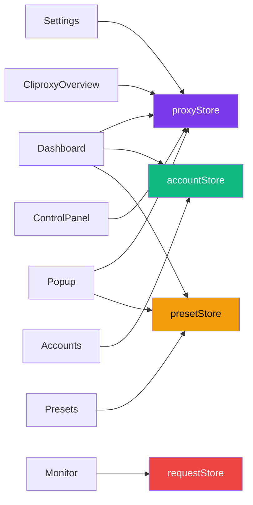
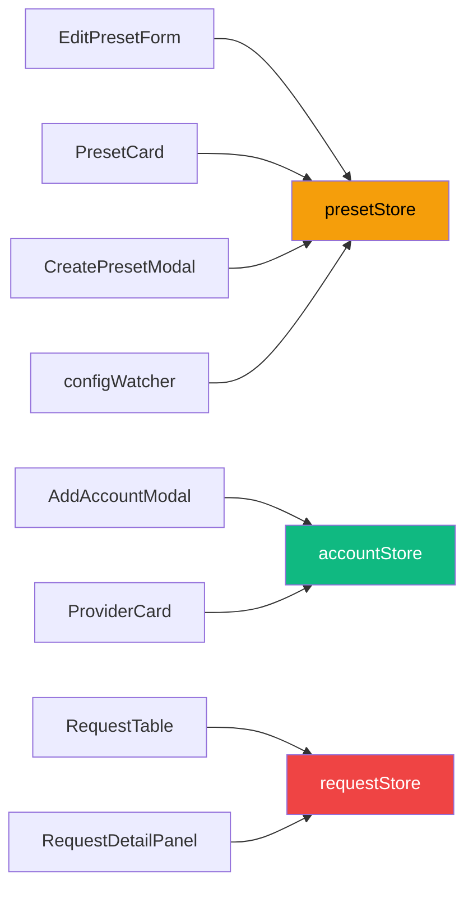
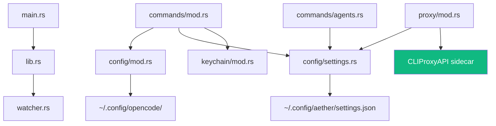

# Aether — Architecture Documentation

> macOS desktop app (Tauri v2 + SolidJS) that manages a bundled Go sidecar (`CLIProxyAPI`) as an AI proxy. GUI for configuring AI agent presets, provider accounts, and proxy routing.
>
> *Auto-generated from the GitNexus knowledge graph — 859 symbols, 1,645 relationships, 36 clusters, 71 execution flows.*

---

## Table of Contents

- [System Overview](#system-overview)
- [Architecture Diagram](#architecture-diagram)
- [Layer Breakdown](#layer-breakdown)
  - [Frontend (SolidJS)](#frontend-solidjs)
  - [Backend (Tauri / Rust)](#backend-tauri--rust)
  - [Sidecar (Go)](#sidecar-go)
- [Functional Areas](#functional-areas)
- [Key Execution Flows](#key-execution-flows)
- [Dependency Graph](#dependency-graph)
- [Configuration & File Paths](#configuration--file-paths)
- [File Index](#file-index)

---

## System Overview

Aether is a **three-layer** desktop application:

```
┌─────────────────────────────────────────────────────┐
│                   macOS Desktop                     │
│  ┌───────────────────────────────────────────────┐  │
│  │           SolidJS Frontend (Vite)             │  │
│  │   Pages · Components · Stores · Styles        │  │
│  └──────────────────┬────────────────────────────┘  │
│                     │ Tauri IPC (invoke)             │
│  ┌──────────────────▼────────────────────────────┐  │
│  │          Rust Backend (Tauri v2)               │  │
│  │   Commands · Config · Proxy · Keychain         │  │
│  └──────────────────┬────────────────────────────┘  │
│                     │ Shell plugin (spawn/stdin)     │
│  ┌──────────────────▼────────────────────────────┐  │
│  │       Go Sidecar (CLIProxyAPI)                │  │
│  │   AI proxy server on port 8317                │  │
│  └───────────────────────────────────────────────┘  │
└─────────────────────────────────────────────────────┘
```

**Two windows:**
- **Main window** (1200×800, overlay titlebar) — full management UI
- **Popup window** (320×400, transparent) — tray quick-access

---

## Architecture Diagram

```mermaid
graph TB
    subgraph Frontend["Frontend (SolidJS)"]
        direction TB

        subgraph Pages
            App[App.tsx]
            Dashboard[Dashboard]
            Presets[Presets]
            Accounts[Accounts]
            Monitor[Monitor]
            Settings[Settings]
            Popup[Popup]
            CliproxyOverview[CliproxyOverview]
            ControlPanel[ControlPanel]
            CliproxyControlPanel[CliproxyControlPanel]
        end

        subgraph Components
            EditPresetForm[EditPresetForm]
            CreatePresetModal[CreatePresetModal]
            PresetCard[PresetCard]
            AddAccountModal[AddAccountModal]
            ProviderCard[ProviderCard]
            RequestTable[RequestTable]
            RequestDetailPanel[RequestDetailPanel]
            Toast[Toast]
            Sidebar[Sidebar]
            TitleBar[TitleBar]
        end

        subgraph Stores
            proxyStore[proxyStore]
            presetStore[presetStore]
            accountStore[accountStore]
            requestStore[requestStore]
            configWatcher[configWatcher]
        end
    end

    subgraph Backend["Backend (Tauri v2 / Rust)"]
        direction TB

        subgraph Commands
            cmd_mod[commands/mod.rs]
            cmd_agents[commands/agents.rs]
        end

        subgraph Config
            config_mod[config/mod.rs]
            config_settings[config/settings.rs]
        end

        subgraph Proxy
            proxy_mod[proxy/mod.rs]
            proxy_events[proxy/events.rs]
        end

        Keychain[keychain/mod.rs]
        Watcher[watcher.rs]
        LibRs[lib.rs]
        MainRs[main.rs]
    end

    subgraph Sidecar["Sidecar (Go)"]
        CLIProxyAPI[CLIProxyAPI Binary]
    end

    %% Frontend → Store dependencies
    App --> proxyStore & configWatcher
    Dashboard --> proxyStore & accountStore & presetStore
    Presets --> presetStore
    Accounts --> accountStore
    Monitor --> requestStore
    Settings --> proxyStore
    Popup --> proxyStore & presetStore
    CliproxyOverview --> proxyStore
    ControlPanel --> proxyStore

    EditPresetForm --> presetStore
    PresetCard --> presetStore
    AddAccountModal --> accountStore
    ProviderCard --> accountStore
    RequestTable --> requestStore
    RequestDetailPanel --> requestStore
    configWatcher --> presetStore

    %% Backend internal
    MainRs --> LibRs
    LibRs --> Watcher
    cmd_mod --> config_mod & config_settings & Keychain
    cmd_agents --> config_settings
    proxy_mod --> config_settings

    %% Cross-layer
    Stores -.->|Tauri invoke| Commands
    proxy_mod -.->|Shell plugin| CLIProxyAPI

    style Frontend fill:#1a1a2e,stroke:#7c3aed,color:#e2e8f0
    style Backend fill:#1a1a2e,stroke:#f59e0b,color:#e2e8f0
    style Sidecar fill:#1a1a2e,stroke:#10b981,color:#e2e8f0
```



---

## Layer Breakdown

### Frontend (SolidJS)

| Area | Files | Responsibility |
|------|-------|---------------|
| **Entry** | `index.tsx`, `App.tsx` | Mount app, define routes, init stores |
| **Pages** | `Dashboard`, `Presets`, `Accounts`, `Monitor`, `Settings`, `Popup`, `CliproxyOverview`, `CliproxyControlPanel`, `ControlPanel` | Top-level views, each consuming 1-3 stores |
| **Components** | `EditPresetForm`, `CreatePresetModal`, `PresetCard`, `AddAccountModal`, `ProviderCard`, `RequestTable`, `RequestDetailPanel`, `Toast`, `Sidebar`, `TitleBar`, etc. | Reusable UI elements |
| **Stores** | `proxyStore`, `presetStore`, `accountStore`, `requestStore`, `configWatcher` | Reactive state + Tauri command wrappers |
| **Styles** | `app.css`, `popup.css` | Tailwind v4 with glassmorphism tokens |

**Store roles:**
- `proxyStore` — proxy lifecycle (start/stop/restart), status polling, event stream
- `presetStore` — CRUD presets, model/provider parsing (`splitModelId`, `getProvider`)
- `accountStore` — provider account management, API key status
- `requestStore` — live request monitoring & detail display
- `configWatcher` — watches external config changes, triggers `presetStore.refresh`

### Backend (Tauri / Rust)

| Module | File(s) | Responsibility |
|--------|---------|---------------|
| **Commands** | `commands/mod.rs` | Tauri commands: preset CRUD, provider accounts, proxy control, file I/O, version info |
| **Agent Commands** | `commands/agents.rs` | AI agent detection & configuration (Claude Code, Cursor, Windsurf, etc.) |
| **Config** | `config/mod.rs` | Read/write OpenCode config (`opencode.json`, `oh-my-opencode-slim.json`), preset operations |
| **Settings** | `config/settings.rs` | App settings persistence (`settings.json`) |
| **Proxy** | `proxy/mod.rs` | Sidecar lifecycle — spawn, write stdin, kill, status tracking |
| **Proxy Events** | `proxy/events.rs` | Event structs (`ProxyStatusEvent`) for frontend streaming |
| **Keychain** | `keychain/mod.rs` | macOS keychain integration for API keys |
| **Watcher** | `watcher.rs` | File system watcher for config hot-reload |
| **App Entry** | `main.rs` → `lib.rs` | Tauri app bootstrap, plugin registration, window setup |

### Sidecar (Go)

The `CLIProxyAPI` binary from `router-for-me/CLIProxyAPI`:
- Runs as an AI proxy server on **port 8317**
- Managed via Tauri shell plugin (spawn → stdin commands → kill)
- Version pinned in `.cliproxyapi-version`
- Binary placed at `src-tauri/binaries/cliproxyapi-{target-triple}`
- Config generated at `~/.config/aether/proxy-config.yaml`

---

## Functional Areas

The knowledge graph identified **36 clusters** grouped into these functional domains:

### 1. Preset Management
> Create, edit, duplicate, delete AI agent presets. Each preset configures a model, provider, and routing rules.

**Key flows:**
- `CreatePresetModal` → `handleCreate` → `presetStore.createPreset` → Tauri `create_preset` → `config/mod.rs` → `read_slim_config` → `opencode_config_dir`
- `EditPresetForm` → `handleSave` → `presetStore.updatePreset` → `refresh`
- `PresetCard` → agent detection / model parsing → `splitModelId`

**Files:** `Presets.tsx`, `EditPresetForm.tsx`, `CreatePresetModal.tsx`, `PresetCard.tsx`, `presetStore.ts`, `config/mod.rs`

### 2. Provider Account Management
> Manage API keys for AI providers (OpenAI, Anthropic, etc.) via macOS keychain.

**Key flow:**
- `get_provider_accounts` → `has_api_key` (keychain) → `get_api_key` → `account_name`

**Files:** `Accounts.tsx`, `AddAccountModal.tsx`, `ProviderCard.tsx`, `accountStore.ts`, `commands/mod.rs`, `keychain/mod.rs`

### 3. Proxy Lifecycle
> Start, stop, restart the Go sidecar. Stream status events to the frontend.

**Key flows:**
- `restart_proxy` → `start_proxy` → `snapshot` → `ProxyStatusEvent` (4 steps)
- `restart_proxy` → `start_proxy` → `read_settings` → `settings_path` (settings resolution)
- `Popup` → `isStopped` → `proxyStatus` (status display)

**Files:** `proxyStore.ts`, `proxy/mod.rs`, `proxy/events.rs`, `config/settings.rs`, `Dashboard.tsx`, `ControlPanel.tsx`, `Popup.tsx`

### 4. Request Monitoring
> Live display of AI requests flowing through the proxy.

**Files:** `Monitor.tsx`, `RequestTable.tsx`, `RequestDetailPanel.tsx`, `requestStore.ts`

### 5. Agent Detection & Configuration
> Detect installed AI agents (Claude Code, Cursor, Windsurf) and configure them to use the proxy.

**Key flow:**
- `configure_cli_agent` → `read_settings` → `settings_path`

**Files:** `commands/agents.rs`, `config/settings.rs`

### 6. App Startup & Config Watching
> Bootstrap the app, start the config file watcher for hot-reload.

**Key flow:**
- `main` → `run` (lib.rs) → `start_config_watcher` (watcher.rs) → `get_modified_time`

**Files:** `main.rs`, `lib.rs`, `watcher.rs`, `configWatcher.ts`

---

## Key Execution Flows

### Flow 1: Edit Preset — Model Resolution (5 steps)
The deepest cross-community flow, resolving a model ID into provider metadata:

```
EditPresetForm.tsx          presetStore.ts
──────────────────         ────────────────
EditPresetForm()
    │
    ├─► dotColor()
    │       │
    │       ├─► provider()
    │       │       │
    │       │       └─► getProvider() ─────►  splitModelId()
    │       │                                    │
    │       └───────────────────────────────── returns {provider, model}
    └─► renders with resolved color
```

### Flow 2: Proxy Restart (4 steps)
```
proxy/mod.rs                          proxy/events.rs
────────────                          ───────────────
restart_proxy()
    │
    └─► start_proxy()
            │
            ├─► snapshot()
            │       │
            │       └─► ProxyStatusEvent ──► frontend event stream
            │
            └─► read_settings() ──► settings_path()
```

### Flow 3: App Bootstrap (4 steps)
```
main.rs ──► lib.rs::run() ──► watcher.rs::start_config_watcher() ──► get_modified_time()
                │
                ├─► register Tauri commands
                ├─► setup plugins (shell, dialog, etc.)
                └─► create main + popup windows
```

### Flow 4: Preset CRUD → Config (4 steps each)
All preset operations follow the same pattern:
```
create_preset / update_preset / delete_preset / ...
    │
    └─► read_slim_config()
            │
            └─► slim_config_path()
                    │
                    └─► opencode_config_dir()  →  ~/.config/opencode/
```

### Flow 5: Provider Accounts → Keychain (4 steps)
```
commands/mod.rs              keychain/mod.rs
───────────────              ───────────────
get_provider_accounts()
    │
    └─► has_api_key()
            │
            └─► get_api_key()
                    │
                    └─► account_name()  →  resolved provider name
```

---

## Dependency Graph

### Frontend: Pages → Stores



### Frontend: Components → Stores



### Backend: Module Dependencies



---

## Configuration & File Paths

| File | Location | Purpose |
|------|----------|---------|
| OpenCode config | `~/.config/opencode/opencode.json` | AI models & providers |
| Slim preset config | `~/.config/opencode/oh-my-opencode-slim.json` | Preset definitions |
| Proxy config | `~/.config/aether/proxy-config.yaml` | Generated sidecar config |
| App settings | `~/.config/aether/settings.json` | User preferences |
| Sidecar binary | `src-tauri/binaries/cliproxyapi-{triple}` | Bundled Go binary |
| Sidecar version | `.cliproxyapi-version` | Pinned version |

> **Why `~/.config/aether/` instead of `~/Library/Application Support/`?**
> The Go sidecar's flag parser breaks on spaces in paths.

---

## File Index

### Rust Backend (`src-tauri/src/`)

| File | Symbols | Role |
|------|---------|------|
| `main.rs` | 1 | Entry point |
| `lib.rs` | 1 (`run`) | App bootstrap, plugin/command registration |
| `commands/mod.rs` | ~15 | All Tauri commands (preset CRUD, proxy, providers, etc.) |
| `commands/agents.rs` | ~9 | Agent detection & configuration |
| `config/mod.rs` | ~13 | Config read/write, path resolution |
| `config/settings.rs` | ~7 | Settings persistence |
| `keychain/mod.rs` | ~4 | macOS keychain API key storage |
| `proxy/mod.rs` | ~8 | Sidecar lifecycle management |
| `proxy/events.rs` | ~3 | Event structs for status streaming |
| `watcher.rs` | ~3 | File system config watcher |

### Frontend (`src/`)

| File | Symbols | Role |
|------|---------|------|
| `App.tsx` | ~5 | Router, layout, store initialization |
| `stores/proxyStore.ts` | ~10 | Proxy state & commands |
| `stores/presetStore.ts` | ~10 | Preset state, model parsing |
| `stores/accountStore.ts` | ~8 | Account state & keychain bridge |
| `stores/requestStore.ts` | ~6 | Request monitoring state |
| `stores/configWatcher.ts` | ~4 | External config change detection |
| `pages/Dashboard.tsx` | ~11 | Main dashboard |
| `pages/Presets.tsx` | ~10 | Preset management |
| `pages/Accounts.tsx` | ~8 | Provider accounts |
| `pages/Popup.tsx` | ~11 | Tray popup |
| `components/EditPresetForm.tsx` | ~12 | Preset editor |
| `components/PresetCard.tsx` | ~9 | Preset display card |
| `components/AddAccountModal.tsx` | ~8 | New account form |
| `components/RequestTable.tsx` | ~7 | Request list |
| `components/RequestDetailPanel.tsx` | ~7 | Request detail view |

---

*Generated from GitNexus knowledge graph analysis. Last indexed: 859 nodes, 1,645 edges, 36 clusters, 71 execution flows.*
